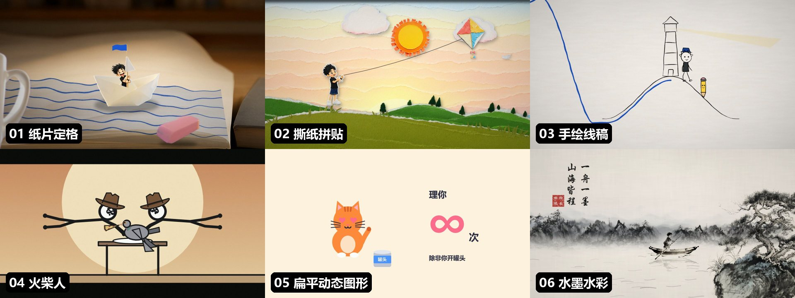
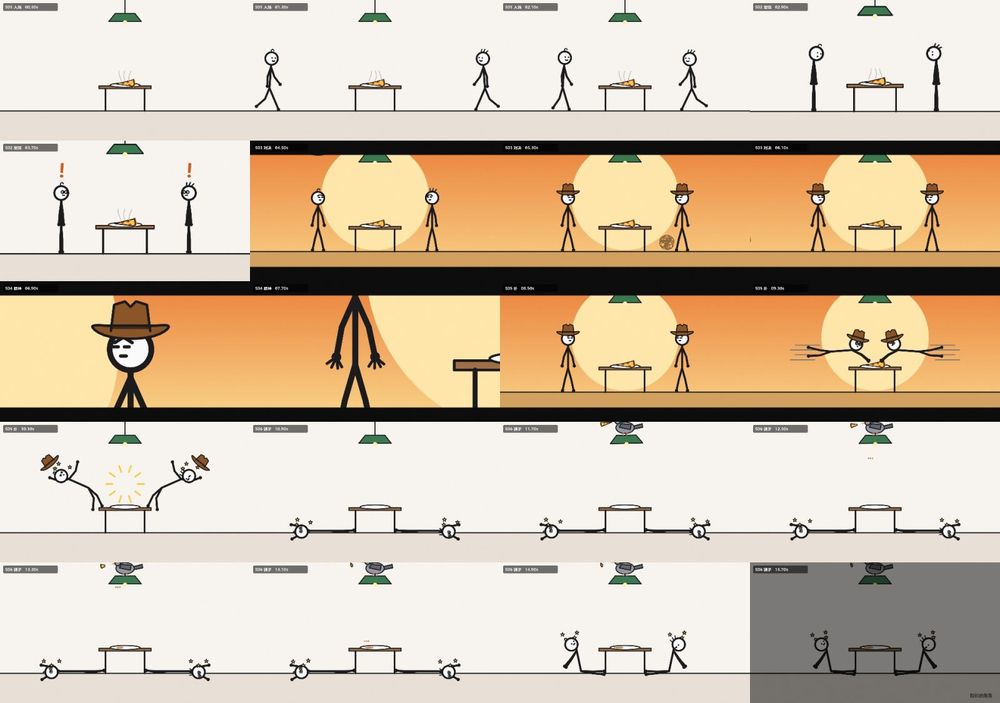
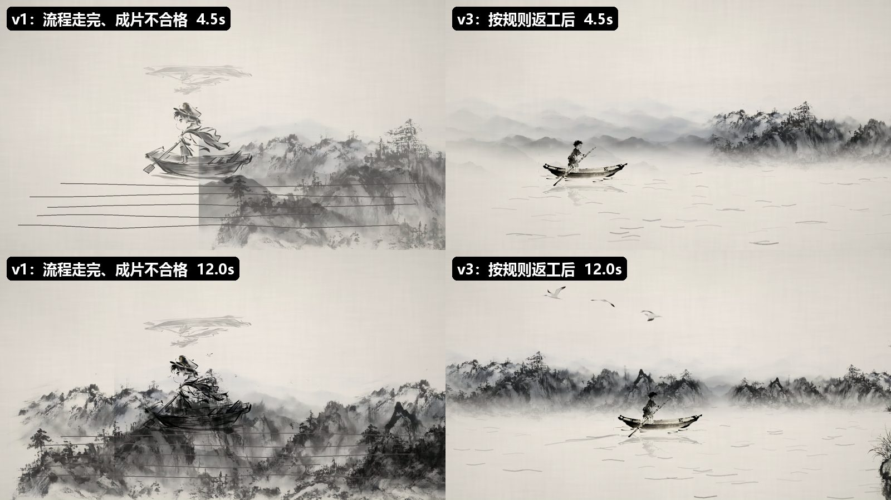
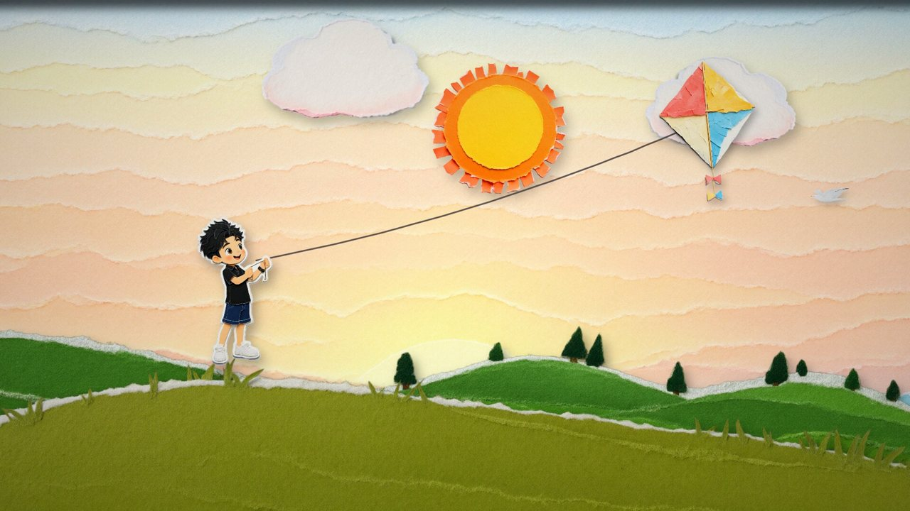
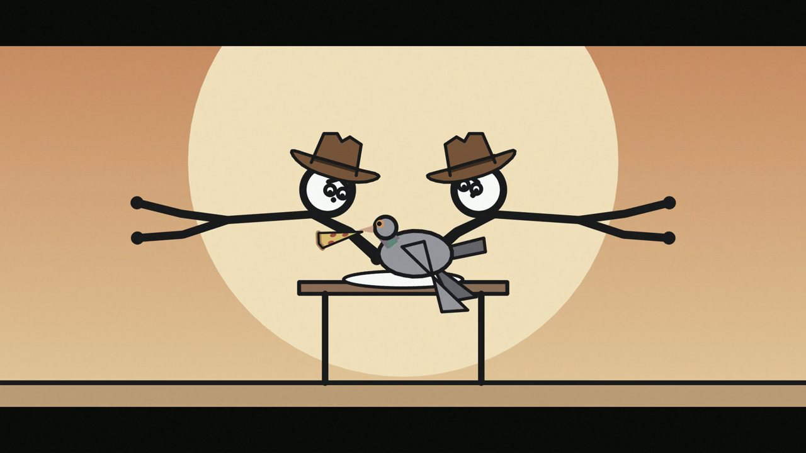
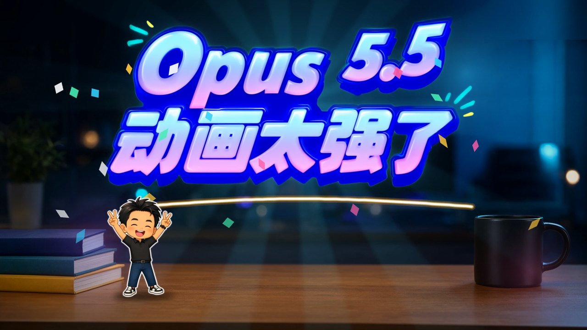
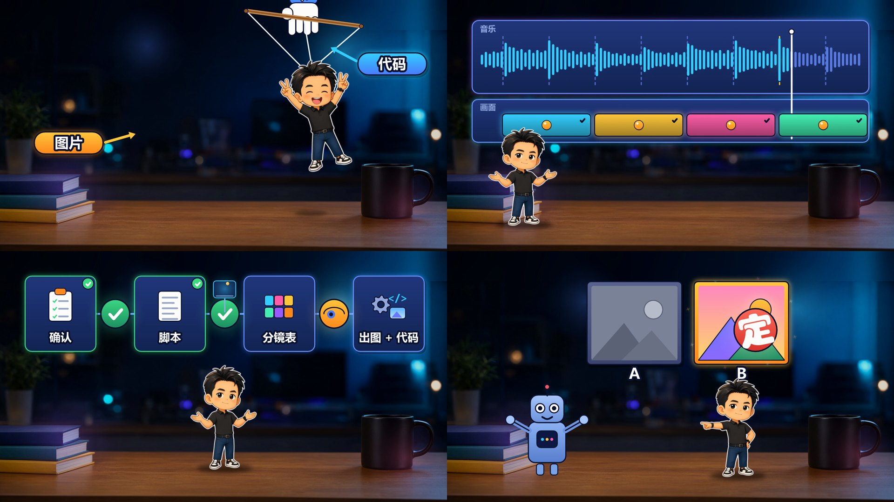

# 1 nook-anim

用代码做动画短片的 Skill。一句话需求进来，按统一流程产出一条带配乐和音效的 MP4。

画面以代码逐帧渲染为主：线条、文字、粒子、镜头、转场、特效都由 Python 画出来；代码画不出的角色和写实场景，交给本地 ComfyUI 的 Qwen Image 2.1 出图补足；配乐走 MiniMax Music3 或直接用代码合成。生视频模型默认不用。



## 1.1 它能做什么

- 15–30 秒的动画短片：情节短片、喜剧小剧场、数据信息图、品牌片尾
- 4–12 秒的 Logo 片头与 Logo 动效
- 给口播、教程类视频配 Broll（每条 10 秒）和章节标题卡（每条 4 秒，带音效）
- 同一个故事可以换六种画风来做，每种风格有一张验证过的风格卡

已经做出来的样片：

| 样片 | 风格 | 时长 | 档位 |
|---|---|---|---|
| 《纸上出航》：纸片小船长在笔记本上画海出航，飞越页边落到便利贴 | 01 纸片定格 | 21 秒 | 代码 + 生图 + MiniMax 配乐 |
| 《撕开清晨》：夜空被撕开，换成清晨放风筝 | 02 撕纸拼贴 | 20 秒 | 代码 + 生图 + MiniMax 配乐 |
| 《画个方向》：线稿小人画出箭头，铅笔替他把路画到灯塔 | 03 手绘线稿 | 20 秒 | 纯代码 + MiniMax 配乐 |
| 《最后一块披萨》：西部对决抢披萨，被鸽子截胡 | 04 火柴人 | 16 秒 | 纯代码，音效全合成 |
| 《一只猫的一天》：信息图讲猫的一天，"理你 0 次"翻成"∞" | 05 扁平动态图形 | 17 秒 | 纯代码，配乐全合成 |
| 《一叶行舟》：墨滴晕开成山水，小船长撑船泊到松下 | 06 水墨水彩 | 20 秒 | 代码 + 生图 |
| 教程视频的 8 条 Broll 和 8 条标题：船长在桌上走，信息面板浮在半空，标题字砸下来 | 07 教程桌面舞台（扩展） | 10 秒 / 4 秒 | 代码 + 生图（背景、姿势、标题字）+ 标题音效 |

## 1.2 亮点

**每一帧都能改，改多少遍都不花钱。** 画面是代码算出来的，改一个时间点、一条轨迹、一种颜色，重新渲染就行。生视频模型抽卡式的"再来一次"在这里不存在，同一份代码永远渲出同一帧。

**每帧只由时间决定。** 场景文件的 `render(t)` 是时间的纯函数，任何一帧都能单独算出来。所以可以只渲几张静帧看效果、按镜头抽帧拼图自查、在浏览器里拖时间轴预览，确认无误再整片渲染。

**生图只补代码画不出的东西，用"三级素材"保证角色一致。** 先出单元素的原素材，再用多图参考出"人抱着笔""人站在船里"这类组合素材，同一角色的所有姿势都从同一张母版编辑。两样东西在镜头里一起动，就出一张组合图，避免代码拼接时穿模。


**画面对音乐，不让音乐对画面。** MiniMax Music3 的时长和 BPM 都不听提示词。做法是生成更长的音乐，代码测出真实节拍，在半小节处截取并补同调收尾和弦，再把镜头切换和关键动作吸附到拍点上，生成一张时间映射表，画面和音效共用。纯代码风格可以直接用代码合成鼓、贝斯和拨弦，和画面共用同一个节拍网格。

**规则来自实测的坑。** `references/rules.md` 里每条规则后面都写着来由，比如"倒影要绕水线翻转""出图模型写不了指定汉字，印章题字一律代码生成""笑点揭晓后至少停 1 秒"。交付前按镜头抽帧拼图，逐条对照检查。 交付前还有一张按构图、运动、文字、声音、交付分类的自查清单（`references/checklist.md`），要对着最终 mp4 的抽帧逐条过。



下面是同一条水墨片，照着流程走完但不按规则检查的 v1，和按规则返工后的 v3。v1 的倒影翻到了人物头顶，没有水面，船坐在山上，水纹是几条平行直线：



**用户只在四个节点把关。** 情节和节拍表、角色定稿、动态分镜、成片。其余步骤 Agent 自己推进；用户说"一路做到成品"时，只交付成片。

## 1.3 六种风格

每种风格的完整风格卡在 `references/styles/`，写着画面材质、技术档位、帧率节奏、运动方式、转场、典型特效、代码参数和踩过的坑。

### 1.3.1 纸片定格


写实微距桌面 + 外圈带白纸边的剪纸角色。角色按 12fps 换姿势（每张停两格），墨线、浪、镜头按 24fps，两种节奏形成手工感。角色和场景由 Qwen Image 出图，代码负责透视贴墨线、逐笔画出、定格调度、镜头推拉。适合情节短片、品牌故事。

### 1.3.2 撕纸拼贴



纸张、图案、角色由生图出透明底素材，撕边、纤维白边、投影、层叠由代码做。纸片"啪"地贴上有过冲、回弹、投影收紧三个阶段，转场是一张纸从画面上撕开。适合观点表达、节目片头。

### 1.3.3 手绘线稿


纯代码。暖白纸纹上的黑色墨线，每 3 帧重抖一次形成手绘颤动，物件按笔画顺序逐笔画出，点缀一两种品牌色。适合知识讲解、口播 B-roll、观点表达。

### 1.3.4 火柴人



纯代码。角色由代码骨骼驱动：姿势关键帧、走路循环、两段反向动力学（手伸向目标）、几笔表情。喜剧三拍都能卡准：预备（蓄力发抖）、夸张（扑出、速度线）、停顿（空中定格）。适合段子、反转小剧场、流程演示。

### 1.3.5 扁平动态图形


纯代码。纯色底 + 几何图形拼出的角色和图标，时间轴按拍写，每拍至少一个元素变化；弹入、弹簧、数字滚动、圆形擦除转场；统一版式（左图形、右"标签 → 大数字 → 单位"）。配乐用代码合成，天然对拍。适合数据、清单、产品要点、反差梗。

### 1.3.6 水墨水彩


山、松、舟、鸟由生图出水墨素材，生宣纸纹、墨滴晕开、水纹、倒影、题款和印章由代码生成，素材一律正片叠底到纸上。构图先定水平线和留白区，镜头平移展开长卷。适合中式叙事、文化内容、金句短片。

### 1.3.7 扩展：Logo 动效


只用一张 Logo 原图做片头和动效：拆出头部、手臂、底图三层，补全被挡住的底图，再做偏头、眨眼、波光、铆钉闪光、圆形收尾。透明底版本可以叠在直播画面或视频角上。这条路线还没收进引擎，列在风格卡的扩展位。

### 1.3.8 教程桌面舞台（扩展，Broll 与章节标题）





给口播、教程、科普类视频配 Broll 和章节标题卡。整期共用一张千问出的"虚化工作室 + 桌面"背景，Q 版船长站在桌上（走路是两帧交替加起伏），信息面板像全息屏一样浮在半空，桌面留给字幕；配色以封面为准（深蓝底 + 霓虹渐变 + 亮黄橙）。标题字由千问出"纯文字透明 PNG"，代码负责砸下、压扁回弹、波浪逐字起跳、扫光、震屏、彩纸和音效。风格卡见 `references/styles/07_教程桌面舞台.md`。

## 1.4 怎么使用

### 1.4.1 对 Agent 说一句话

装好 Skill 后，直接描述想要的片子：

```text
用 nook-anim 做一条 15 秒的火柴人短片：两个人抢最后一块披萨，被鸽子截胡。
用水墨风格做一条 20 秒的品牌片尾，主角是 Captain Nook 撑船。
做一条扁平动态图形：一只猫的一天，每拍一变，结尾来个反转。
```

说清楚三件事就够：讲什么、多长、什么风格。风格没想好可以不说，Agent 会按内容类型推荐。

### 1.4.2 生产流程

```text
1  定内容类型与叙事骨架
2  选风格卡（决定技术路线和素材清单）
3  一句话情节 + 节拍表 ................ 用户把关
4  分镜表（时长、机位、画面节点、角色排期、代码任务、声音、素材）
5  出素材：原素材 → 组合素材 → 首帧 ..... 用户把关（角色定稿）
6  标注坐标：平面四角、角色锚点与接触点
7  写场景文件 scene.py
8  动态分镜，缺素材用灰色剪影占位 ....... 用户把关
9  补齐素材、按反馈精修
10 配乐与对拍
11 正片：抽帧拼图逐条质检后交付 ........ 用户把关
```

纯代码风格（手绘线稿、火柴人、扁平动态图形）跳过第 5 步出图，通常一轮就能从零做到成片。

### 1.4.3 用户需要做的事

- 在四个把关节点看产物、给反馈。反馈越具体越好，例如"9 秒船应该在人物前面""旗子方向反了"。
- 用到生图和 MiniMax 配乐时，保证本地 ComfyUI 开着。
- 看成片。渲染时可以打开预览工作台看进度和最新一帧。

### 1.4.4 交付物

每条片子一个项目文件夹：

```text
<项目>/
├── 成片 .mp4
├── 过程图/          抽帧拼图、素材总览、自查对比（JPG）
└── 工程/
    ├── scene.py     场景文件（换电脑能直接渲染，素材路径全部相对）
    ├── sfx.py       音效（有的还有配乐剪辑、终混脚本）
    ├── warp.json    画面对拍的时间映射表（用了 MiniMax 配乐时）
    └── 素材/        透明底 PNG
```

## 1.5 内容类型

| 类型 | 时长 | 骨架 | 状态 |
|---|---|---|---|
| Logo 片头 | 4–10 秒 | 登场 → 一个亮点动作 → 定格收尾 | 已有样片 |
| 情节短片 | 15–30 秒 | 目标 → 障碍 → 解决 → 落到品牌 | 已有样片 |
| 喜剧小剧场 | 12–20 秒 | 目标 → 对峙 → 高潮 → 反转 → 反应 | 已有样片 |
| 清单反转 | 12–20 秒 | 开场 → 数据逐条升级 → 最后一条反转 → 收尾 | 已有样片 |
| 知识讲解 | 60 秒以上 | 钩子 → 问题 → 原理拆解 → 例子 → 总结，旁白驱动 | 骨架已写，尚无样片 |
| 口播 B-roll 与章节标题 | 跟随原片 | 跟着口播走，讲到哪配到哪；章节标题用逐字稿二级标题原文 | 已有样片 |
| 歌词 MV | 跟随歌曲 | 主歌、副歌分配视觉母题，剪辑点对节拍 | 骨架已写，尚无样片 |

## 1.6 技术支撑

### 1.6.1 必需（所有风格）

| 项 | 说明 |
|---|---|
| Python | 3.10 以上（3.14 实测可用） |
| Python 包 | numpy、opencv-python、pillow、scipy、imageio-ffmpeg |
| ffmpeg | 由 imageio-ffmpeg 自带，也可用 `NOOKANIM_FFMPEG` 指定 |
| 字体 | 默认用 Windows 自带：微软雅黑粗体（界面、MG 文字）、华文行楷（中文手写、题款）、Segoe Print（英文手写）、华文隶书（印章）。其他系统用环境变量指向等价字体 |

```bash
pip install numpy opencv-python pillow scipy imageio-ffmpeg
```

纯代码风格只需要这些，不需要显卡。20 秒 1080p 的片子，普通 CPU 整片渲染约 3–6 分钟。

### 1.6.2 可选：生图（纸片定格、撕纸拼贴、水墨水彩需要）

| 项 | 说明 |
|---|---|
| ComfyUI | 本地运行，默认 `http://127.0.0.1:8188`，可用 `NOOKANIM_COMFY` 改 |
| 模型 | UNET `qwen_image_2.1_int8_convrot`、CLIP `qwen3vl_8b_int8_convrot`、VAE `qwen_image_2.1_vae_bf16` |
| 加速 LoRA | `p_qwen_image_2.1_8step_v0.1`（8 步，推荐）。没装时在出图任务里写 `"lora": null`，改走 25 步、CFG 1（同官方模板）的原始通道 |
| 编辑节点 | 官方 `TextEncodeQwenImage21`，多图参考与透明底都走它 |
| 显卡 | 12G 显存可用。有加速 LoRA 时 3060 12G 每张约 15–30 秒；没有时（25 步）5060 Ti 16G 上 1024×768 的编辑图每张约 1–2.5 分钟，2048×640 的标题字约 30–60 秒 |
| 许可 | 以官方要求为准，见 [Qwen-Image-2.1](https://github.com/QwenLM/Qwen-Image-2.1) 仓库的 LICENSE |

### 1.6.3 可选：AI 配乐

MiniMax Music3 的 ComfyUI API 格式工作流，用 `NOOKANIM_MUSIC_WORKFLOW` 指向它。不用时可以用代码合成配乐（火柴人、扁平动态图形的样片就是这样做的）。

### 1.6.4 环境变量一览

| 变量 | 默认值 | 作用 |
|---|---|---|
| `NOOKANIM_COMFY` | `http://127.0.0.1:8188` | ComfyUI 地址 |
| `NOOKANIM_FONT_DIR` | `C:/Windows/Fonts` | 字体目录 |
| `NOOKANIM_FONT_UI` | 微软雅黑粗体 | 界面、MG 文字 |
| `NOOKANIM_FONT_HAND_ZH` | 华文行楷 | 中文手写 |
| `NOOKANIM_FONT_HAND_EN` | Segoe Print Bold | 英文手写 |
| `NOOKANIM_MUSIC_WORKFLOW` | 空 | MiniMax Music3 工作流路径 |
| `NOOKANIM_FFMPEG` | imageio-ffmpeg 自带 | ffmpeg 路径 |

## 1.7 目录结构

```text
nook-anim/
├── SKILL.md                 Agent 读的流程与硬规则
├── README.md                本文
├── assets/readme/           README 配图
├── references/
│   ├── content.md           内容类型、叙事骨架、分镜拆解、喜剧节奏
│   ├── tech-routing.md      每一层画面由代码、生图还是生视频生产
│   ├── image-gen.md         出图通道、三级素材、提示词模板
│   ├── music.md             配乐生成、测拍、截取、对拍
│   ├── scene-api.md         场景文件接口与模块速查
│   ├── rules.md             通用规则（每条注明来由）
│   ├── checklist.md         交付前质量自查清单
│   └── styles/              六张默认风格卡 + 一张扩展卡 + 索引
├── examples/                可直接渲染的样例场景（三条纯代码短片 + 教程 Broll 与标题的共用件）
└── scripts/
    ├── run.py               命令行入口（自动把 scripts/ 加进路径）
    ├── preview_launcher.py  预览工作台
    └── nookanim/            渲染引擎
```

## 1.8 命令速查

`<S>` 指本 Skill 的 `scripts/` 目录。

```bash
# 出图（jobs.json：name、prompt、refs、w、h、seed、alpha、lora、steps、cfg）
python <S>/run.py comfy image jobs.json --out 素材

# 静帧、抽帧拼图、整片
python <S>/run.py render scene.py stills 3.5 7.9 --labels
python <S>/run.py render scene.py sheet --every 1.5
python <S>/run.py render scene.py video --out film.mp4 --audio mix.wav --warp warp.json

# 预览工作台：拖时间轴、跳镜头、点击取坐标、看渲染进度
python <S>/preview_launcher.py scene.py --port 8765

# 配乐：生成、测拍截取、对拍
python <S>/run.py comfy music --caption cap.txt --max 30 --seeds 301,302 --out music
python <S>/run.py music music/music_s301.mp3 --dur 20 --end-by 19.3 --anchors 3,6,9 --out-dir .
```

一个最小的场景文件：

```python
W, H, FPS, DUR = 1920, 1080, 24, 10.0
SHOTS = [(0, "S01 开场"), (5, "S02 收尾")]

def render(t):
    """返回第 t 秒的 BGR 画面（float 0–1 或 uint8），必须只由 t 决定。"""
    ...
```

## 1.9 引擎模块

引擎 `nookanim` v0.5.0。

| 模块 | 内容 |
|---|---|
| core | 缓动、弹簧、定格量化、关键帧、时间映射 |
| geom | 透视平面（标四个角）、大场景图摄像机、定格抖动 |
| assets | 读图（中文路径安全）、锚点、同母版对齐、景深变体、星光与符号 |
| draw | 贴图、接触阴影、正片叠底、场景坐标折线、马克笔、逐笔画出 |
| fx | 弹出符号、速度线、飞溅、漩涡、风线、手写字、小旗 |
| sketch | 手绘线稿：纸纹、重抖线、墨线层 |
| collage | 撕纸拼贴：纸片投影、贴上、定格颤动、撕洞、纸屑 |
| wash | 水墨：生宣纸纹、墨滴渗化、写意水波 |
| stick | 火柴人：骨骼、姿势关键帧、走路循环、反向动力学、表情、二维镜头 |
| mg | 扁平动态图形：节拍网格、文字贴片、弹入、圆形擦除、弧形进度、数字滚动 |
| post | 暗角、颗粒、淡入淡出、镜头号 |
| audio | 音效合成与混音 |
| music | 测节拍调性、截取补收尾、对拍映射表 |
| comfy | ComfyUI 出图与 MiniMax 配乐客户端 |
| render | 静帧、抽帧拼图、整片（进度文件、对拍、配音轨） |
| preview | 预览工作台 |

新故事需要的特效先写在场景文件里，好用的再收进引擎。

## 1.10 边界

- 不做：剪辑现成视频素材、只要一张图。
- 生视频（MiniMax H3）默认关闭，只在需要连续真实表演（口型、转身、舞蹈）且用户明确开启时用。
- 角色一律原创，不画知名 IP。
- 出图模型写不了指定汉字，片中的中文字（题款、印章、标语）一律由代码用字体生成。
- 引擎渲染的整片暂不支持透明底输出（Logo 动效的透明底用的是独立脚本）；标题卡目前都是带背景的整屏片段。
- 模型许可以官方要求为准：千问 Image 2.1 见 [Qwen-Image-2.1](https://github.com/QwenLM/Qwen-Image-2.1) 仓库的 LICENSE，MiniMax-Music3 见 [MiniMax-Music3](https://github.com/MiniMax-AI/MiniMax-Music3) 仓库的 LICENSE。本 skill 不对是否商用给出建议。纯代码风格不涉及这两项。

## 1.11 现状与待办

v0.5（260929）：六种默认风格各有一条样片，另有教程 Broll 与标题的扩展风格；引擎覆盖全部六种风格。交付前质量自查清单已写（`references/checklist.md`）。

从零验证（260928）：在另一个笔记库的新会话里，只告诉 Agent skill 的位置和"用我的 IP 形象做一条动画"，它读完 SKILL.md 和风格卡，自己规划、出图（桌面场景和欢呼姿势两张）、写场景和音效、渲染出 10.5 秒的《弹簧船长》，整条流程跑通，过程中自查修了三处（弹簧没画完人就悬空、镜头没跟上导致人出画、字被人挡住）。这次验证有两个限制：Agent 参考了作者本地的样例工程；skill 没有注册到技能目录，是用户给了路径才找到的。所以公开版把三条纯代码样例放进了 `examples/`，安装时把 skill 目录放进 Agent 的技能目录即可。

待做：

1. 公开版的盲测：只有 skill 和一句需求，不带任何本地样例，看能否独立做出合格成片。
2. 知识讲解（旁白 + 字幕）、歌词 MV 两种内容类型的样片。
3. 引擎支持透明底输出，标题卡才能直接叠在别的画面上；铅笔、水彩笔刷。
4. 把教程 Broll 项目里的共用件（玻璃卡片、发光、图标、船长与走路、标题动效）整理进引擎，目前它们放在 `examples/tutorial_kit/` 里，靠 `from common import *` 使用。
