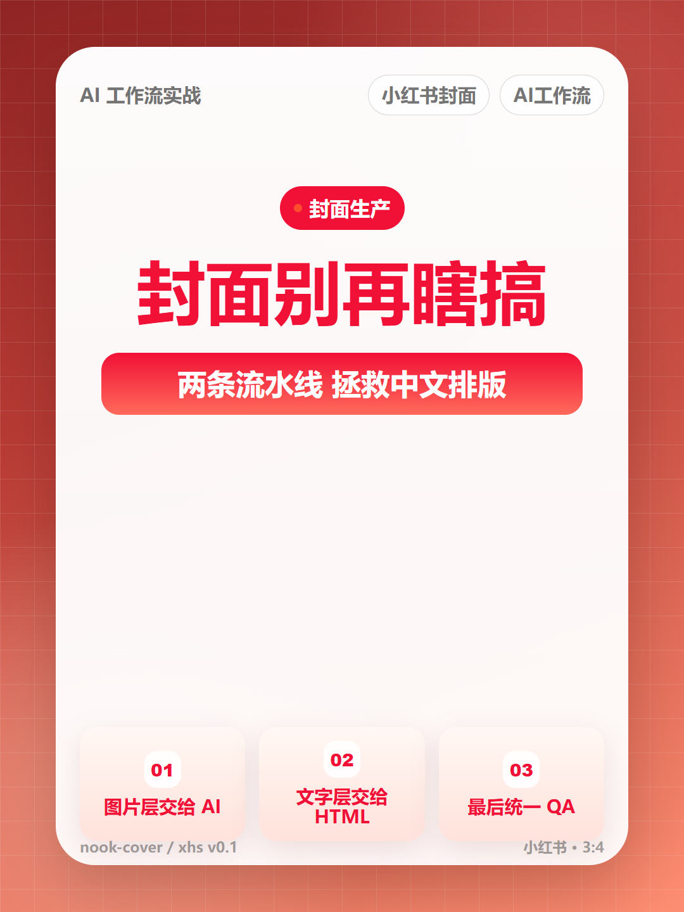

# nook-cover

`nook-cover` 是一个自媒体封面生产 skill。当前版本聚焦小红书封面。

当前状态：`v0.2 alpha`。适合教程演示、流程验证和二次开发；还不建议宣传为完全无人值守的生产级封面系统。

它把封面生产拆成两条路线：

- **快速成图路线**：用 image2.0 直接生成完整小红书封面候选。
- **稳定文字路线**：如果模型中文不满意，再用 HTML / 后处理复刻标题层。

这不是一个 Photoshop 模板包，也不是单纯提示词合集。它的核心是：先选视觉系统，再按场景选择出图工具，最后做封面 QA。

## 效果预览

### image2.0 直出候选

这一路线负责先拿到真实的小红书封面感：人物、贴纸、撕纸、大字冲击和平台语气。


### HTML / Playwright 稳定文字层

当模型中文不稳定，或者需要批量复刻标题层时，用 HTML / 后处理控制文字、位置和输出。



### V04-2 样张九宫格

九宫格用于观察视觉系统差异和真实选题下的候选效果。


## 当前能力

- 小红书 3:4 封面。
- 4 套视觉系统：
  - 人脸冲击封面。
  - 手账拼贴种草。
  - 产品截图主视觉。
  - 近大远小对比封面。
- 可选接入 3 套出图工具：
  - `nook-zimage`：低成本草图、亚洲人物、背景探索。
  - `nook-qwen-image`：中文海报、中文视觉、中文文字参与画面的测试。
  - `nook-image2-gpt` 或 Codex 内置 image2.0：高质量成品、图生图、正式主视觉。
- HTML / Playwright 路线作为稳定文字层和复刻层。

## 推荐工作流

```text
一句主题
→ 生成封面 brief
→ 选择四套视觉系统之一
→ 调用合适的出图工具
→ 生成完整封面候选
→ QA 检查中文、人脸、标题、缩略图
→ 如果中文不稳，用 HTML / 后处理复刻标题层
→ 输出 PNG
```

## 快速开始

安装依赖：

```bash
npm install
npx playwright install chromium
```

如果 Windows 下 npm cache 权限报错，可以把 cache 放到项目内：

```bash
npm install --cache ./.npm-cache
```

跑一张 HTML / Playwright 文字稳定路线样张：

```bash
node scripts/render-xhs-cover.cjs examples/N1-prompt-pack/brief.json output/demo
```

输出：

```text
output/demo/index.html
output/demo/cover.png
```

把这个项目交给 AI 编程助手时，可以直接说：

```text
请阅读 SKILL.md 和 references/v04-2-workflow.md。
帮我用 nook-cover 生成一张小红书封面。
主题：普通人做封面别再瞎搞。
优先使用 image2.0 生成完整封面候选。
如果中文不准确，再走 HTML / 后处理复刻标题层。
```

如果需要配置外部出图工具，运行：

```bash
node scripts/setup-provider.cjs
```

这个脚本会自动寻找同级目录中的 `nook-zimage`、`nook-qwen-image`、`nook-image2-gpt`，并把路径写入 `nook-cover/.env`。`nook-cover/.env` 只是一张路由表，不保存出图 API key。

API key / base URL 放在各原子工具自己的 `.env` 中。`setup-provider.cjs` 会提示是否继续运行各工具自己的 `setup.js`，由原子工具引导用户输入自己的 key/url。

更完整的部署说明见 `references/deployment.md`。

## 发布注意

不要提交或打包这些本机运行产物：

```text
node_modules/
.npm-cache/
.ms-playwright/
.env
output/
```

如果 Playwright 浏览器下载很慢，可以让 AI 编程助手使用本机已有 Chrome / Chromium，并设置 `PLAYWRIGHT_CHROMIUM_EXECUTABLE`。

## 四套视觉系统

### 人脸冲击封面

适合副业、成长、情绪、转型、口播类封面。

关键词：

```text
真人半身 / 三分之二身、大标题、厚描边、贴纸、箭头、星星、强表情
```

内部别名：人物冲击贴纸风。

### 手账拼贴种草

适合探店、书单、护肤、生活方式、收藏清单。

关键词：

```text
撕纸毛边、胶带、便签、手账、生活场景、可读手写字
```

内部别名：撕纸手账种草风。

### 产品截图主视觉

适合 AI 工具、教程、效率、工作流。

关键词：

```text
真人讲解、霓虹、斜切面板、警示贴、大标题、科技背景
```

内部别名：科技教程爆款风。

### 近大远小对比封面

适合健身、自律、逆袭、前后变化、避坑。

关键词：

```text
黑橙高对比、斜向动势、before/after、粗箭头、刷痕、强冲击
```

内部别名：黑橙冲击对比风。

## QA 标准

每张图必须检查：

- 中文标题是否正确。
- 标题是不是第一视觉。
- 人物是否完整，不是只有人头。
- 标题有没有遮住眼睛、鼻子、嘴巴。
- 四套风格是否真的不同，而不是换颜色。
- 缩略图下是否可读。
- 画面是否有足够信息密度，不是死留白。

## 参考文件

- `SKILL.md`：agent 入口。
- `references/v04-2-workflow.md`：当前主流程。
- `references/xhs-poster-v03-visual-systems.md`：视觉系统和 QA 规则。
- `references/provider-routing.md`：三套出图工具分工。
- `references/v04-2-prompt-recipes.md`：四套风格提示词模板。
- `references/deployment.md`：部署和使用入口。
