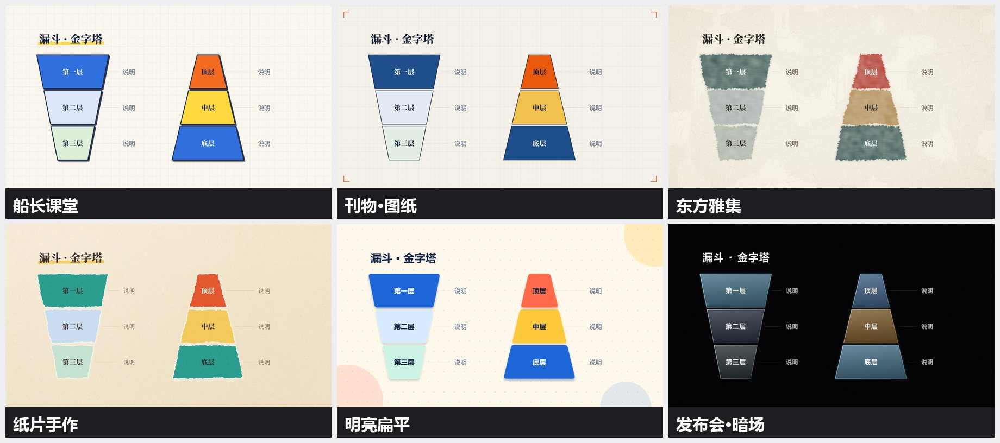
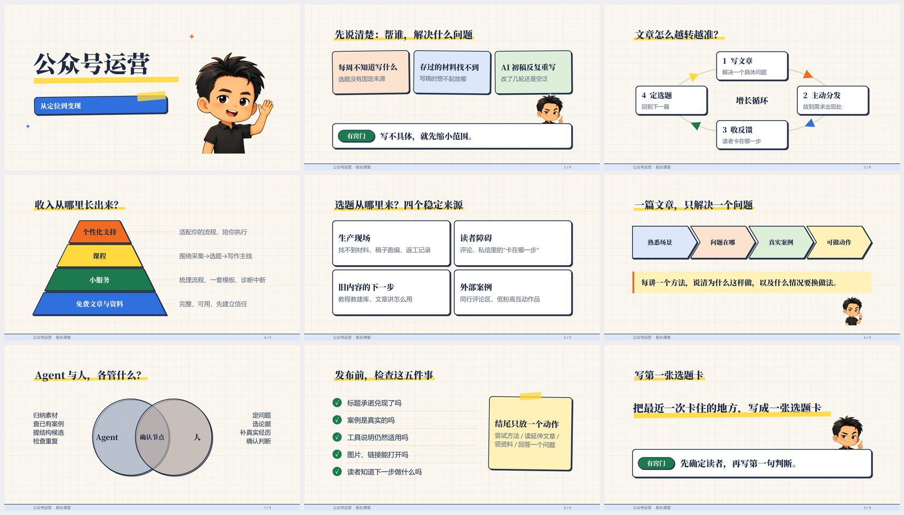
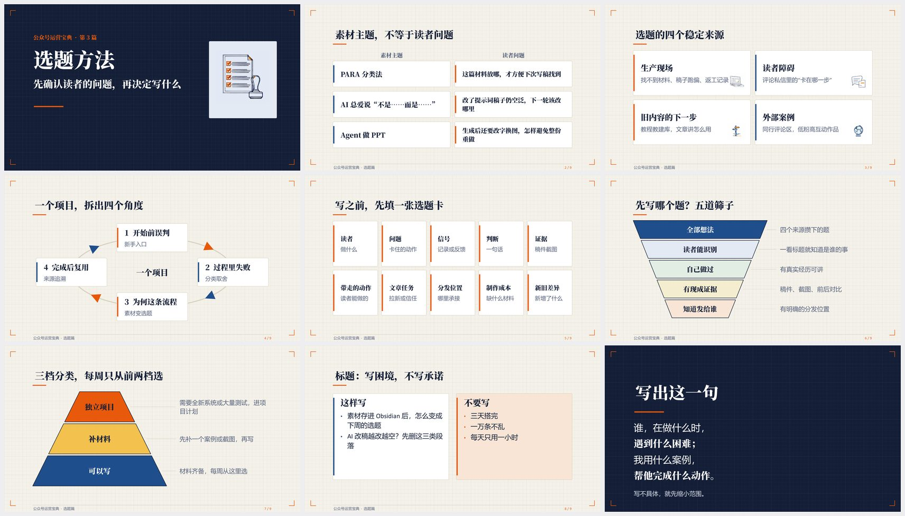
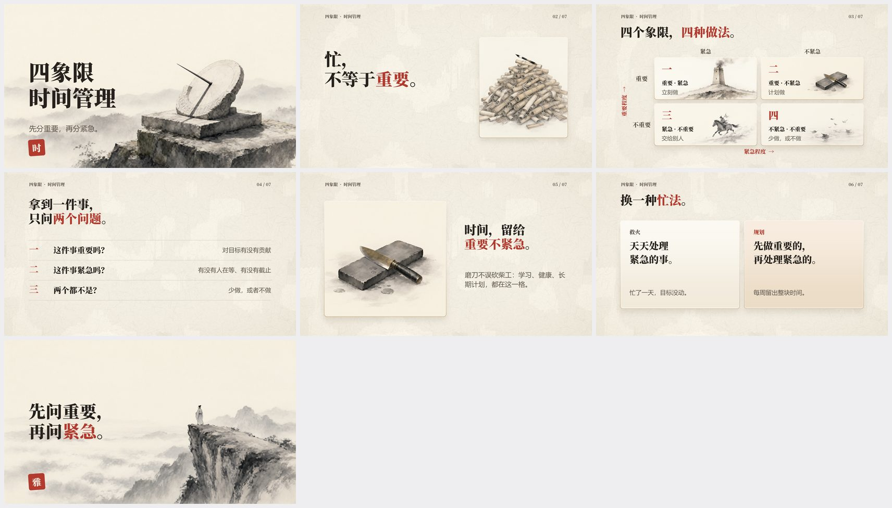
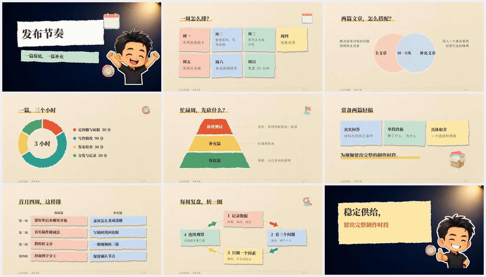
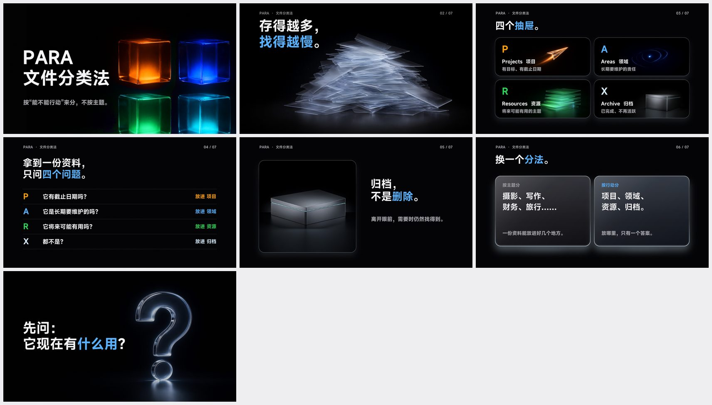

# nook-ppt

用"零件 + 网格 + 量字"生成**可编辑 PPTX** 的 skill。文字、表格、图表、流程图、金字塔、循环图都是 PowerPoint 里的原生对象，可以继续改；风格材质（纸片、水墨、玻璃……）做成容器图片，文字仍是真文字。默认交付一份**带动效**的 PPTX。版本 2.0-alpha（预览版）。

## 要求

- **Windows + Microsoft PowerPoint**（核验、逐页导出、加动效、平滑切换都通过 PowerPoint 的 COM 完成；Mac 和 WPS 暂不支持）。
- Python 3.10 以上，`pip install -r requirements.txt`。
- 字体（可选）：字体文件**不随库提供**，请自行下载安装，名称和下载地址见 [assets/fonts/README.md](assets/fonts/README.md)（思源宋体、霞鹜文楷、MiSans）。没装的字体会自动退回系统自带的微软雅黑，版式不会坏，只是字形不同。
- 出图（可选）：本机 ComfyUI + Qwen Image 2.1，或任意图像 API，见下文"自己生成素材"。


## 快速开始

```bash
pip install -r requirements.txt
python scripts/run_deck.py examples/build_keynote_para.py ./out              # 构建、核验、自动检查、加动效，输出一份带动效的 PPTX
python scripts/run_deck.py examples/build_yaji_quadrant.py ./out --dark     # 换变体
python examples/gallery_parts.py paper-craft ./out                           # 零件陈列页：一个风格里所有图示和小件
```

做自己的 PPT：参考 `examples/` 里的脚本（用 `Deck`、`Kit` 和各风格的零件），流程见 [SKILL.md](SKILL.md)。

## 六套风格

| 风格 | 气质 | 样片 |
|---|---|---|
| 船长课堂 | 方格笔记本、墨线描边加硬投影、船长贴纸 | `build_captain_wechat.py` |
| 刊物·图纸 | 编辑刊物加工程图纸，细墨线、编号、留白 | `build_editorial_topic.py` |
| 东方雅集 | 宣纸、水墨、朱砂印章，另有暗墨青金线版 | `build_yaji_quadrant.py` |
| 纸片手作 | 撕边纸片、胶带、桌面质感 | `build_papercraft_rhythm.py` |
| 明亮扁平 | 圆角糖果色、彩色软影、Q 版船长 | `build_flatbright_outreach.py` |
| 发布会·暗场 | 近黑底、大字、玻璃质感、3D 图，另有浅色版 | `build_keynote_*.py`（三份） |

图示（循环、金字塔、漏斗、矩阵、阵列、韦恩、环形图）会按风格换成对应材质，文字仍是真文字，见 [references/diagrams.md](references/diagrams.md)。下图是同一组图示（漏斗和金字塔）在六套风格里的样子：



各风格样片的全部页面：

| | |
|---|---|
| <br>船长课堂 | <br>刊物·图纸 |
| <br>东方雅集 | <br>纸片手作 |
| <br>明亮扁平 | <br>发布会·暗场 |

## 目录

| 位置 | 内容 |
|---|---|
| `scripts/` | 引擎 `slidekit.py`、材质 `diagram_skins.py`、页面小工具 `deckkit.py`、一键流程 `run_deck.py`、自动检查 `lint_deck.py`、PowerPoint 脚本 |
| `references/` | 模式、流程、素材槽位、风格、图示、质量清单、字体与反模板 |
| `assets/styles/<风格>/` | 主题 `theme.py`、底图、出图任务 `jobs_*.json`、提示词 `prompts.md`、风格素材 |
| `assets/library/` | **素材库**：可复用的图标、船长姿势、装饰（见下） |
| `examples/` | 样片脚本和零件陈列页 |

## 素材库与船长 IP

**素材库**（`assets/library/`）：透明底 PNG，可直接用在你的 PPT 里。

| 文件夹 | 内容 |
|---|---|
| `icons_ink` | 墨线描边图标 10 个 |
| `icons_blue` | 淡蓝手绘图标 5 个 |
| `editorial_icons` | 「刊物·图纸」线稿图标 18 个 |
| `captain_poses` | Q 版船长全身姿势 9 个 |
| `deco` | 星光、彩纸屑、Logo |

风格包里另带各自的图标（`deco/`）、船长提示表情（`captain-class/tips/` 15 张）和出好的 3D 图、水墨图（`raw/`）。

**船长是作者原创的 Q 版角色（Captain Nook IP）**，是船长课堂、明亮扁平、纸片手作三套风格的形象，随库提供是为了让这三套风格开箱即用。角色形象的版权归作者；用本 skill 做你自己的演示文稿可以使用；若要把角色素材本身单独转发、二次发行或用于商业产品，请先联系作者。**你可以完全不用船长**：见下文替换方法。

## 自己生成素材（素材库和船长 IP 都可以自己重新生成或替换）

素材库、风格素材、船长 IP 都是用图像模型生成的，**只要你能跑本地 ComfyUI（Qwen Image 2.1），或者有别的出图 API，就可以自己生成，不依赖本库提供的图**。

1. **出图任务和提示词都在库里**：每个风格包有 `prompts.md`（风格提示词骨架、颜色分工、配图规则）和 `jobs_*.json`（每张图的名称、提示词、尺寸、种子、是否透明底）。
2. **用本地 ComfyUI**：先启动 ComfyUI 并装好 Qwen Image 2.1 的模型（所需模型见 `scripts/comfy_image.py` 开头），然后 `python scripts/comfy_image.py assets/styles/<风格>/jobs_xxx.json --out assets/styles/<风格>/raw`；地址不是默认的 `127.0.0.1:8188` 时设环境变量 `NOOKPPT_COMFY`。
3. **用别的出图 API**：把 `jobs_*.json` 里的 `prompt` 原样发给你的图像 API，尺寸取 `w`、`h`；`alpha: true` 的要透明底 PNG（API 不支持透明就生成纯色底再抠图）；按 `name` 存成同名 PNG，放回对应目录即可，代码按文件名取图。
4. **替换船长**：用你自己的角色母版图，再用图像编辑（参考图加"保持角色，改成某某表情或姿势"）批量生成表情，覆盖 `captain-class/tips/` 里的同名文件；或者不用提示卡（`tip()`）和贴纸，三套风格的版式、图示仍然完整。
5. **完全不出图也能用**：底图（宣纸、渐变）由 `make_bg.py` 用代码生成（首次构建时自动生成，需要 numpy、Pillow），图示材质由 `diagram_skins.py` 用代码渲染，不需要任何图像模型；只是样片里的图片位置会缺，换成你自己的图即可。

## 许可与来源

代码、字体、图片的许可和来源见 [NOTICE.md](NOTICE.md)。

## 状态与已知限制

- 预览版：动效、平滑切换的真实放映效果仍在验证中。
- 有材质的风格里，环形图的数据不能在 PowerPoint 里直接改（要改脚本重新生成）；没有材质的风格用原生图表。
- 材质容器是图片，在 PowerPoint 里拉大会稍微拉伸；改字不受影响。
- 只支持 Windows + PowerPoint。

变更见 [CHANGELOG.md](CHANGELOG.md)。
