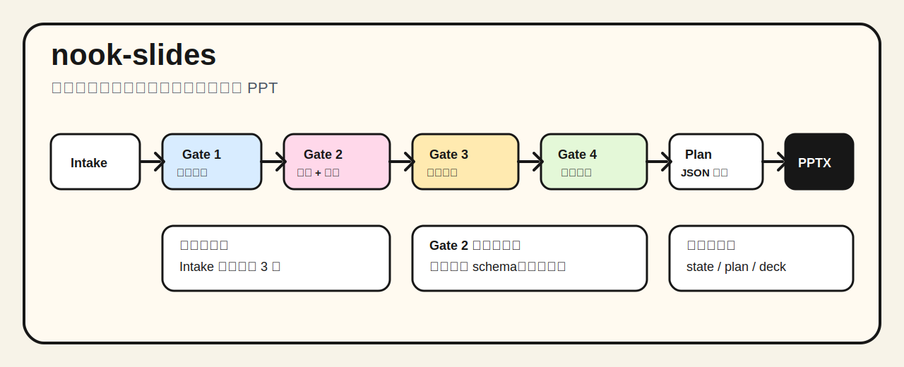

# nook-slides

`nook-slides` 是一个中文 PPT / slides 生产 skill。它不是自由排版工具，而是把内容生产拆成一套可确认、可回溯、可校验的填空题流程。



## 它解决什么问题

很多 AI 做 PPT 的问题不在于不会写，而在于太容易跳步：一上来问太多问题，文案还没锁就开始做版式，版式不合适又临场改字，最后生成出来的 PPT 看似完成，其实不可复盘。

`nook-slides` 把 PPT 生产拆成几道 gate：

```text
Intake
→ Gate 1 内容草案确认
→ Gate 2 页面形式确认，并锁定可见文字
→ Gate 3 选择视觉系统
→ Gate 4 资产计划
→ 填写 deck_plan.json
→ 渲染 editable PPTX
→ 校验交付
```

核心原则是：先确认，再填空；先锁文字，再生成 PPT。

## 当前能力

- 中文优先的 slides / PPT 工作流。
- 三套中文视觉系统：
  - `duotone-zine`：双色独立刊物风。
  - `oriental-dark-yaji`：东方暗调雅集风。
  - `bright-street-dance`：明亮街舞贴纸风。
- 13 个全局组件骨架，三套视觉系统共用同一套结构。
- `notes/interaction-state.json` 状态机，保证流程可以跨 agent / 跨电脑续接。
- `validate_interaction_state.py`，校验提问数量、gate 状态、Gate 2 后文字锁等交互约束。
- `validate_plan.py`，校验 `deck_plan.json` 是否只使用批准组件、变体和字段。
- `build_deck.py`，当前支持 `duotone-zine` 的 editable PPTX 渲染。

## 重要限制

当前真正可生产 editable PPTX 的视觉系统只有：

```text
duotone-zine
```

`oriental-dark-yaji` 和 `bright-street-dance` 已有 13 页组件样本库，但 deterministic PPTX renderer 还没有批准。用户如果要求这两套直接输出 editable PPTX，agent 必须报告阻塞，不能临场写一套一次性 renderer。

## 交互规则

`nook-slides` 默认不让 agent 一次性抛出一长串问题。

Intake 阶段每轮最多问 3 个问题，并且优先给选择题和推荐默认值。只有源材料缺失时，才允许开放式询问。

Gate 2 是最后的文字微调窗口。页面形式确认后，必须写入：

```json
{
  "locks": {
    "text_locked": true,
    "locked_after_gate": "gate2_page_forms",
    "accepted_copy_path": "content/accepted-copy.md",
    "visible_copy_path": "content/visible-copy.json"
  }
}
```

之后进入视觉系统、资产计划、`deck_plan.json` 和 PPTX 渲染时，不能再改可见文字。如果必须改字，就回退 Gate 2 或 Gate 1。

## 快速开始

对 agent 说：

```text
用 nook-slides，把这份材料做成 10 页左右 editable PPTX。按严格 gate 流程来，不要跳过确认。
```

如果要更快，可以说：

```text
用 nook-slides 快速默认模式。内容和页面形式你先按最佳判断落地，只在最终生成前问我一次确认。
```

正式交付建议仍使用严格 gate 流程。

## 目录结构

```text
nook-slides/
├── SKILL.md
├── README.md
├── assets/
│   ├── illustrations/
│   ├── schemas/
│   └── templates/
├── references/
└── scripts/
```

## 样本库

三套视觉系统的组件样本在：

```text
assets/templates/duotone-zine/component-library-v0.4.0.pptx
assets/templates/oriental-dark-yaji/component-library-v0.1.0.pptx
assets/templates/bright-street-dance/component-library-v0.1.0.pptx
```

这些样本用于对照三套视觉语言是否共享同一套 13 组件骨架。

## 常用校验

校验交互状态：

```bash
python scripts/validate_interaction_state.py path/to/notes/interaction-state.json
```

校验 deck plan：

```bash
python scripts/validate_plan.py path/to/data/deck_plan.json
```

生成 editable PPTX：

```bash
python scripts/build_deck.py --plan path/to/data/deck_plan.json --out path/to/output/deck.pptx
```

校验 PPTX：

```bash
python scripts/validate_deck.py path/to/output/deck.pptx
python scripts/diagnose_deck.py path/to/output/deck.pptx
```

## 适合场景

- 培训课件。
- 汇报型 PPT。
- 方法论演示。
- 把 Markdown、文章、笔记整理成 slides。
- 需要长期复用同一套视觉系统和组件规范的内容生产。

## 不适合场景

- 临场自由设计单页海报。
- 没有确认过程的一次性“帮我随便做个 PPT”。
- 要求 agent 即兴发明版式、颜色、坐标或组件。
- 要求未批准视觉系统直接输出 editable PPTX。
